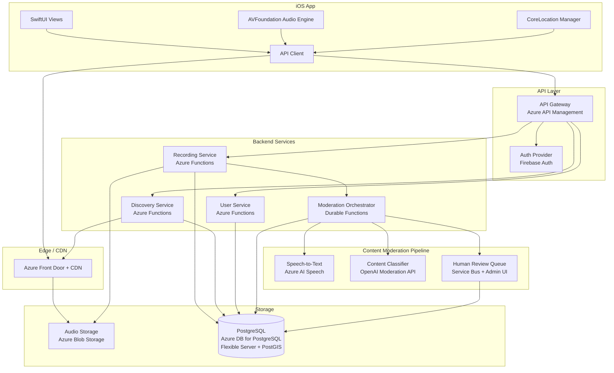
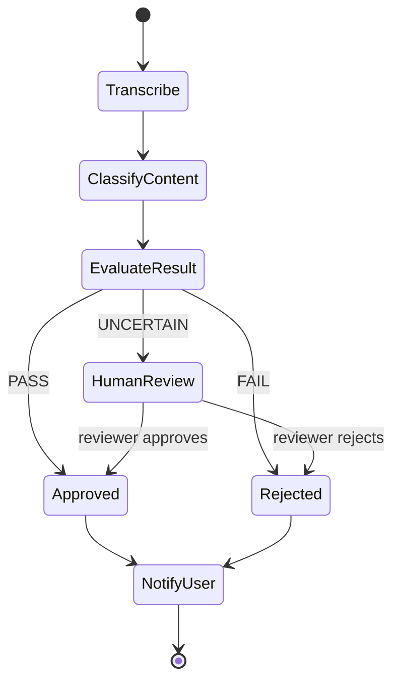

# Hear Here — System Architecture

## 1. Overview

Hear Here is a location-based audio storytelling app for iOS. Users record short audio stories tied to real-world locations. Recordings pass through a content moderation pipeline before becoming publicly discoverable by other users who are physically nearby.

---

## 2. High-Level Component Diagram



---

## 3. Data Flow

### 3.1 Recording Upload Flow

```
User records audio
    → iOS app captures via AVFoundation (AAC, max 5 minutes)
    → App requests a SAS upload URL from Recording Service
    → App uploads audio directly to Azure Blob Storage via SAS URL
    → App sends recording metadata (location, subject, description) to Recording Service
    → Recording saved to DB with status = "pending_moderation"
    → Moderation pipeline triggered asynchronously
```

### 3.2 Content Moderation Flow

```
Durable Functions orchestration starts
    → Azure AI Speech converts audio to text
    → Transcript stored in DB alongside recording
    → Transcript sent to OpenAI Moderation API for content classification
    → Classification result evaluated:
        - PASS (confidence >= 0.95): status → "approved", recording becomes discoverable
        - FAIL (confidence >= 0.95): status → "rejected", creator notified
        - UNCERTAIN: status → "pending_review", sent to human review queue (Service Bus)
    → Human reviewer approves or rejects via admin UI
    → Final status written to DB, creator notified via push notification
```

### 3.3 Discovery Flow

```
User opens app in a location
    → iOS sends user coordinates to Discovery Service
    → Discovery Service runs PostGIS spatial query:
        ST_DWithin(recording.location, user_point, radius_meters)
    → Returns approved recordings within radius, sorted by distance
    → App displays pins on map + list view
```

### 3.4 Playback Flow

```
User taps a recording
    → App requests playback URL from Discovery Service
    → Service returns Azure Front Door signed URL (time-limited via SAS token)
    → App streams audio via AVPlayer from CDN
    → Play event logged for analytics
```

---

## 4. Authentication Strategy

**Provider: Firebase Authentication**

**Rationale:**
- Proven, free-tier-friendly auth for mobile apps
- Native iOS SDK with Sign in with Apple (required for App Store) and Google Sign-In
- Issues JWTs that are easily verified server-side by Azure API Management via a validate-jwt policy
- Handles token refresh, session management, and account linking
- No need to build or maintain auth infrastructure

**Flow:**
1. User signs in via Firebase Auth SDK on iOS (Apple ID or Google)
2. Firebase issues a JWT ID token
3. App sends JWT in `Authorization: Bearer <token>` header with every API request
4. Azure API Management `validate-jwt` inbound policy verifies the token against Firebase's public keys (JWKS endpoint)
5. Policy extracts `uid` claim and passes it downstream via a custom header (`X-User-Id`)

**Why not Azure AD B2C?** Firebase Auth has a significantly better iOS developer experience, simpler setup, and a generous free tier. Azure AD B2C's configuration complexity (custom policies, XML-based flows) is overkill for a consumer mobile app. If enterprise SSO requirements emerge later, Azure AD B2C can be added as a secondary provider.

---

## 5. Content Moderation Pipeline

### Architecture: Azure Durable Functions Orchestration

The moderation pipeline is an asynchronous workflow orchestrated by Durable Functions. This provides visibility, retries, fan-out/fan-in patterns, and easy extension — all within the Azure Functions runtime without a separate orchestration service.



### Components

| Step | Technology | Details |
|------|-----------|---------|
| Speech-to-Text | Azure AI Speech (batch transcription) | Async transcription job via Speech Services REST API. Supports en-US initially; expandable. Output stored in Blob Storage + DB. |
| Content Classification | OpenAI Moderation API | Evaluates transcript for hate, violence, sexual content, self-harm, etc. Returns per-category scores. |
| Decision Logic | Azure Functions (activity function) | Compares moderation scores against thresholds. High-confidence pass/fail auto-decided; uncertain cases routed to human review. |
| Human Review | Azure Service Bus + Admin Web UI | Queue-based with message sessions for ordering. Admin UI (simple React app) lets reviewers listen to audio, read transcript, and approve/reject. Durable Functions uses the external events pattern to wait for human input. |
| Notification | APNs via Azure Notification Hubs | Managed push delivery to iOS devices, no server to maintain. |

### Why OpenAI Moderation API over Azure Content Safety?

OpenAI's moderation endpoint is free, purpose-built for content safety, and returns granular category scores. Azure Content Safety is a viable alternative with similar capabilities and would keep the stack single-vendor, but carries per-transaction costs. If vendor consolidation or data residency becomes a priority, the classifier is a swappable component behind the Durable Functions interface.

---

## 6. Location-Based Discovery

### Geospatial Approach: PostGIS on Azure Database for PostgreSQL Flexible Server

**Why PostGIS:**
- Industry-standard geospatial extension for PostgreSQL
- Native spatial indexing (GiST indexes) for fast radius queries
- Rich function library: `ST_DWithin`, `ST_Distance`, `ST_MakePoint`
- Azure Database for PostgreSQL Flexible Server supports PostGIS out of the box
- Avoids the complexity of a separate geospatial service

### Schema (relevant columns)

```sql
CREATE EXTENSION postgis;

CREATE TABLE recordings (
    id              UUID PRIMARY KEY DEFAULT gen_random_uuid(),
    user_id         TEXT NOT NULL,            -- Firebase UID
    subject         VARCHAR(200) NOT NULL,
    description     TEXT,
    location        GEOGRAPHY(Point, 4326) NOT NULL,
    audio_blob_path TEXT NOT NULL,
    duration_sec    INTEGER NOT NULL,
    status          VARCHAR(20) NOT NULL DEFAULT 'pending_moderation',
                    -- pending_moderation | approved | rejected | pending_review
    transcript      TEXT,
    moderation_result JSONB,
    created_at      TIMESTAMPTZ NOT NULL DEFAULT now(),
    updated_at      TIMESTAMPTZ NOT NULL DEFAULT now()
);

CREATE INDEX idx_recordings_location ON recordings USING GIST (location);
CREATE INDEX idx_recordings_status ON recordings (status);
CREATE INDEX idx_recordings_user_id ON recordings (user_id);
```

### Discovery Query

```sql
SELECT id, subject, description, duration_sec,
       ST_Distance(location, ST_MakePoint(:lng, :lat)::geography) AS distance_m
FROM recordings
WHERE status = 'approved'
  AND ST_DWithin(location, ST_MakePoint(:lng, :lat)::geography, :radius_m)
ORDER BY distance_m ASC
LIMIT 50;
```

Default discovery radius: **500 meters**, configurable per request up to 5 km.

---

## 7. API Design

### Approach: REST over HTTPS

REST is the pragmatic choice for a mobile client — simple, cacheable, well-tooled, and universally understood.

### Base URL

```
https://api.hearhere.app/v1
```

### Endpoints

| Method | Path | Description | Auth |
|--------|------|-------------|------|
| `POST` | `/recordings` | Create recording metadata, get SAS upload URL | Required |
| `GET` | `/recordings/{id}` | Get single recording details | Required |
| `GET` | `/recordings/nearby?lat={lat}&lng={lng}&radius={m}` | Discover nearby recordings | Required |
| `GET` | `/recordings/{id}/playback` | Get signed playback URL | Required |
| `GET` | `/recordings/mine` | List current user's recordings | Required |
| `DELETE` | `/recordings/{id}` | Delete own recording | Required |
| `GET` | `/users/me` | Get current user profile | Required |
| `PUT` | `/users/me` | Update profile | Required |
| `POST` | `/reports` | Report a recording | Required |

### Request/Response Format

All requests and responses use JSON. Audio upload/download uses SAS URLs for Blob Storage (not the API itself).

**Example: Create Recording**

```
POST /v1/recordings
Authorization: Bearer <firebase_jwt>
Content-Type: application/json

{
    "subject": "The Old Oak Tree",
    "description": "This oak has been here since 1850...",
    "latitude": 37.7749,
    "longitude": -122.4194,
    "duration_sec": 45,
    "audio_format": "aac"
}
```

**Response:**

```json
{
    "id": "a1b2c3d4-...",
    "upload_url": "https://hearhereaudio.blob.core.windows.net/recordings/...?sv=...&sig=...",
    "upload_expires_at": "2026-02-26T21:00:00Z",
    "status": "pending_upload"
}
```

The client uploads audio to `upload_url` via HTTP PUT, then the server detects the completed upload (via Blob Storage event via Event Grid) and triggers the moderation pipeline.

### Versioning

URL-path versioning (`/v1/`). Simple, explicit, easy to manage.

---

## 8. Technology Decisions Summary

| Decision | Choice | Rationale |
|----------|--------|-----------|
| iOS Framework | SwiftUI + Swift 6 | Modern declarative UI; best path for new iOS projects |
| Audio Capture | AVFoundation | Native, full-featured audio recording/playback |
| Maps | MapKit | Native iOS maps, no additional SDK dependency |
| Auth | Firebase Auth | Best mobile auth DX; free tier covers early growth |
| API Gateway | Azure API Management (Consumption tier) | Built-in JWT validation policies, rate limiting, analytics; consumption tier is pay-per-call |
| Compute | Azure Functions (Node.js 20) | Zero ops, pay-per-use, fits request/response pattern; consumption plan for cost efficiency |
| Orchestration | Azure Durable Functions | Workflow orchestration within the Functions runtime; no separate service needed; built-in retry, fan-out, and external event patterns |
| Database | PostgreSQL 16 on Azure Database for PostgreSQL Flexible Server | Relational integrity + PostGIS for geospatial; flexible server tier offers burstable compute |
| Audio Storage | Azure Blob Storage | Durable, cheap, SAS URL support for secure direct upload/download |
| CDN | Azure Front Door + Azure CDN | Low-latency audio streaming globally; integrated WAF for edge security; SAS tokens for access control |
| Speech-to-Text | Azure AI Speech (batch transcription) | Managed, async, good accuracy, stays in Azure ecosystem |
| Content Moderation | OpenAI Moderation API | Free, accurate, purpose-built for content safety |
| Push Notifications | APNs via Azure Notification Hubs | Managed push delivery, cross-platform ready for future Android support |
| IaC | Bicep | Azure-native IaC; concise, type-safe, first-class tooling in VS Code; no external dependencies |
| Monitoring | Azure Monitor + Application Insights | Integrated logging, metrics, distributed tracing across Functions and APIM; no additional setup |
| Admin UI | React (Vite) | Simple SPA for human review queue; hosted on Azure Static Web Apps |

---

## 9. Security Considerations

### Authentication & Authorization
- All API endpoints require a valid Firebase JWT
- Azure API Management `validate-jwt` policy verifies token signature against Firebase JWKS endpoint (cached)
- Users can only modify/delete their own recordings (enforced server-side via `uid`)
- Admin endpoints (human review) require an `admin` custom claim in the Firebase JWT

### Audio Content
- Audio files stored in a private Blob Storage container — no public access
- Upload via time-limited SAS URLs (15-minute expiry, write-only permission)
- Playback via Azure Front Door with SAS-signed URLs (1-hour expiry, read-only permission)
- All audio passes through moderation before becoming discoverable
- Rejected audio is soft-deleted (retained 30 days for appeals, then permanently deleted via Blob lifecycle policy)

### Location Privacy
- Precise user location is never stored server-side (only used transiently for discovery queries)
- Recording locations are stored (the user explicitly chose to pin a story there)
- The API does not expose which users are currently nearby
- Discovery queries are rate-limited to prevent location scraping

### Data Protection
- All data in transit over TLS 1.2+
- Blob Storage encryption at rest (Azure-managed keys, SSE)
- Azure Database for PostgreSQL encryption at rest enabled by default
- Database credentials managed via Azure Key Vault, accessed by Functions via managed identity
- No PII stored beyond Firebase UID, display name, and email
- Managed identities used for all service-to-service authentication (Functions → Blob Storage, Functions → Key Vault) — no connection strings in app settings

### Rate Limiting
- Azure API Management rate-limit policies: 100 requests/second per user
- Upload limit: 10 recordings per user per day (prevents abuse)
- Discovery queries: 60 per minute per user

---

## 10. Scalability Considerations

### Current Design Ceiling

The serverless-first architecture (Azure Functions + API Management + Blob Storage + Front Door) scales horizontally with zero configuration for most components. The primary bottleneck is the relational database.

### Database Scaling Path

1. **Phase 1 (0–10K users):** Single Flexible Server instance (Burstable B2s), read replicas if needed
2. **Phase 2 (10K–100K users):** Add read replicas for discovery queries; write primary for recording creation; upgrade to General Purpose tier
3. **Phase 3 (100K+ users):** Scale to Memory Optimized tier; evaluate partitioning recordings by geographic region; consider Citus extension for horizontal sharding if needed

### Audio Storage

Blob Storage scales infinitely. Azure Front Door handles traffic spikes for popular recordings. No action needed.

### Moderation Pipeline

- Azure AI Speech batch transcription scales automatically (request concurrent job limit increases as needed)
- Durable Functions scales with the consumption plan to thousands of concurrent orchestrations
- Human review queue (Service Bus) scales with partitioned queues; add reviewers as volume grows
- Bottleneck is human review — invest in improving auto-classification confidence to reduce human queue volume over time

### Cost Optimization

- Azure Functions (Consumption plan): pay only for executions — near-zero cost at low traffic
- Blob Storage: audio files are small (AAC, ~1MB per minute); storage costs are minimal; use Cool tier for rejected/archived audio
- Azure AI Speech: ~$0.01/minute for batch transcription — the largest variable cost
- Flexible Server: fixed cost on burstable tier; right-size instance to traffic; auto-stop during off-hours in dev
- OpenAI Moderation API: free (as of 2025)

### Future Considerations

- **Android:** The backend is platform-agnostic. Add an Android client pointing at the same API. Azure Notification Hubs already supports FCM.
- **Multi-region:** Deploy Functions + API Management in additional regions; replicate database with Azure Database for PostgreSQL geo-redundancy.
- **Offline support:** Cache nearby recordings on device for areas with poor connectivity.

---

## 11. Project Structure (Proposed)

```
hear-here/
├── docs/
│   └── ARCHITECTURE.md          # This document
├── ios/                          # iOS app (Xcode project)
│   └── HearHere/
│       ├── App/                  # App entry point, configuration
│       ├── Features/
│       │   ├── Auth/             # Authentication views & logic
│       │   ├── Recording/        # Audio recording feature
│       │   ├── Discovery/        # Map & nearby recordings
│       │   ├── Playback/         # Audio playback
│       │   └── Profile/          # User profile
│       ├── Core/
│       │   ├── Network/          # API client, request/response models
│       │   ├── Location/         # Location manager
│       │   ├── Audio/            # Audio engine wrapper
│       │   └── Models/           # Shared data models
│       └── Resources/            # Assets, strings
├── infra/                        # Bicep infrastructure templates
│   ├── main.bicep                # Top-level orchestration
│   ├── modules/
│   │   ├── api.bicep             # API Management
│   │   ├── functions.bicep       # Function App + plans
│   │   ├── storage.bicep         # Blob Storage accounts
│   │   ├── database.bicep        # PostgreSQL Flexible Server
│   │   ├── frontdoor.bicep       # Front Door + CDN
│   │   ├── servicebus.bicep      # Service Bus namespace + queues
│   │   ├── speech.bicep          # Azure AI Speech service
│   │   ├── notifications.bicep   # Notification Hubs
│   │   └── monitoring.bicep      # Application Insights + Log Analytics
│   └── parameters/
│       ├── dev.bicepparam
│       └── prod.bicepparam
├── backend/
│   ├── functions/                # Azure Functions handlers
│   │   ├── recordings/
│   │   ├── discovery/
│   │   ├── users/
│   │   └── authorizer/           # Firebase JWT middleware
│   └── moderation/               # Durable Functions orchestrator + activity functions
├── admin/                        # Human review admin UI (React on Static Web Apps)
└── scripts/                      # Dev scripts, DB migrations
```
