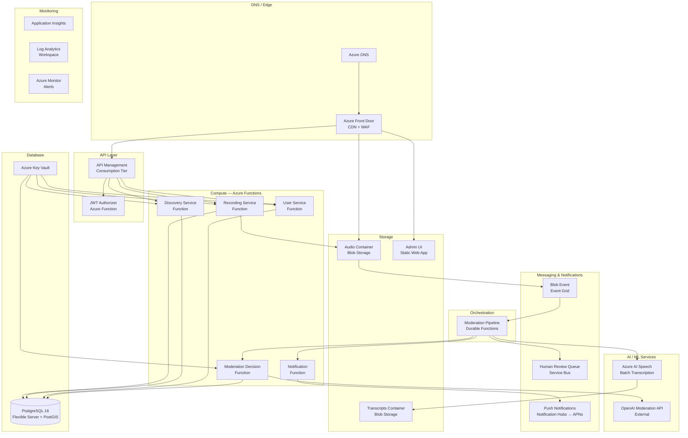
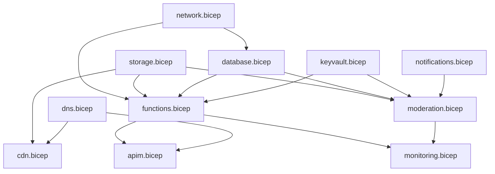

# Hear Here — Cloud Infrastructure Architecture

## 1. Overview

This document defines the cloud infrastructure for Hear Here, a location-based audio storytelling iOS app. The architecture aligns with the system design in [ARCHITECTURE.md](./ARCHITECTURE.md) and maps all backend infrastructure to **Microsoft Azure** services, covering provisioning, scaling, cost, CI/CD, and operational concerns across all environments.

---

## 2. Cloud Provider Selection

**Primary provider: Microsoft Azure**

| Criterion | Azure | AWS | GCP |
|-----------|-------|-----|-----|
| Serverless compute | Azure Functions (Consumption + Premium) — mature, flexible hosting plans | Lambda — mature, pay-per-invocation | Cloud Functions / Cloud Run — good |
| Managed PostgreSQL + PostGIS | Flexible Server — modern, supports PostGIS, VNet integration | RDS — battle-tested | Cloud SQL — capable |
| Object storage + CDN | Blob Storage + Azure CDN / Front Door — integrated | S3 + CloudFront — seamless | GCS + Cloud CDN |
| Speech-to-text (managed, async) | Azure AI Speech — batch transcription API, high accuracy | Transcribe — native, async | Speech-to-Text — good |
| Workflow orchestration | Durable Functions — code-first, native to Functions runtime | Step Functions — best-in-class visual | Workflows — newer |
| IaC tooling | Bicep (first-party, Azure-native) or Terraform | CDK (first-party) | Pulumi or Terraform |
| iOS push notifications | Azure Notification Hubs — multi-platform, APNs native | SNS — native APNs integration | FCM |
| Free tier / startup friendliness | $200 credit + always-free tiers; Azure for Startups program | Generous free tier, 12 months | Always-free tiers on some services |

**Decision:** Azure provides a cohesive serverless platform (Azure Functions + Durable Functions), a modern managed PostgreSQL offering (Flexible Server with PostGIS), native speech-to-text (Azure AI Speech), and first-party IaC via Bicep. The Functions hosting model offers flexible scaling options (Consumption for cost efficiency, Premium for VNet integration and reduced cold starts) that map well to the Hear Here workload.

**Cross-provider dependency:** Firebase Authentication (Google) is the sole non-Azure service. This is intentional — Firebase Auth provides the best iOS developer experience and is accessed only at the edge (client-side SDK + JWT validation). It does not create infrastructure lock-in. An Azure AD B2C alternative is evaluated in Section 9.

---

## 3. Infrastructure Diagram



---

## 4. Audio File Storage

### Azure Blob Storage Design

All blobs reside in a single Storage Account per environment: `hearherestore{env}` (storage account names must be globally unique, lowercase, no hyphens).

| Container | Purpose | Access Pattern |
|-----------|---------|----------------|
| `audio-pending` | Uploaded audio awaiting moderation | Upload via SAS URL; read by moderation pipeline |
| `audio-approved` | Moderated and approved audio | Served via Azure Front Door (CDN) with SAS tokens |
| `audio-rejected` | Rejected audio pending deletion | Internal access only; lifecycle-managed |
| `transcripts` | Azure AI Speech output JSON | Written by Speech service; read by moderation function |

### Storage Account Configuration

```
Account kind:           StorageV2 (General-purpose v2)
Performance:            Standard
Replication:            LRS (dev/staging), ZRS (production)
Access tier (default):  Hot
Encryption:             Microsoft-managed keys (SSE with AES-256)
Public access:          Disabled (all containers private)
TLS minimum version:    1.2
Blob versioning:        Disabled (audio files are immutable once uploaded)
CORS:                   Configured for iOS app pre-signed upload
Diagnostic logging:     Enabled → Log Analytics workspace
```

### Blob Path Structure

```
audio-pending/     {recording_id}.aac     # Uploaded, awaiting moderation
audio-approved/    {recording_id}.aac     # Approved, served via CDN
audio-rejected/    {recording_id}.aac     # Rejected, pending deletion
transcripts/       {recording_id}.json    # Transcription output
```

### Lifecycle Management Policies

| Rule | Scope | Action | Timing |
|------|-------|--------|--------|
| Rejected cleanup | `audio-rejected` container | Delete blob | 30 days after creation |
| Pending timeout | `audio-pending` container | Move to `audio-rejected` | 7 days (upload started but never completed) |
| Cool tier transition | `audio-approved` container | Move to Cool access tier | 90 days since last access |
| Archive tier transition | `audio-approved` container | Move to Archive tier | 365 days since last access |

### Event Grid Integration

Blob creation events (`Microsoft.Storage.BlobCreated` on `audio-pending` container) are published via Azure Event Grid to trigger the Durable Functions moderation pipeline. Event Grid provides reliable, filtered event delivery with at-least-once semantics.

---

## 5. API Hosting

### Decision: Azure Functions (Premium Plan) behind API Management

**Why serverless over containers:**

| Factor | Azure Functions (Serverless) | Azure Container Apps |
|--------|------------------------------|----------------------|
| Ops burden | Minimal — managed runtime, no container images | Moderate — Dockerfiles, image registry, scaling rules |
| Cost at low traffic | Near-zero on Consumption plan; ~$50/mo on Premium | Minimum ~$20/month per container app |
| Cost at high traffic | Premium plan provides predictable pricing | More cost-efficient at sustained high throughput |
| Cold starts | Consumption: 1-3s; Premium: ~0 (pre-warmed instances) | None after startup |
| VNet integration | Premium plan — native VNet integration | Native VNet integration |
| Scaling | Automatic (event-driven or HTTP) | KEDA-based auto-scaling |
| Fit for this project | Excellent — short-lived HTTP handlers + Durable Functions for orchestration | Overkill for early-stage app |

**Decision:** Azure Functions on the **Premium Plan (EP1)** for production. The Premium plan eliminates cold starts and enables VNet integration (required for private database access). For dev/staging, the **Consumption plan** keeps costs near zero. If sustained high traffic materializes (100K+ users), specific hot-path functions (e.g., discovery) can be migrated to Container Apps.

### API Management Configuration

```
Tier:                   Consumption (serverless — pay per call)
Protocol:               HTTPS only
API versioning:         URL path (/v1/)
Rate limiting:          100 req/s per subscription key (mapped to user)
JWT validation:         Built-in policy (validate-jwt) for Firebase tokens
Caching:                Built-in response cache for discovery queries (30s TTL)
Custom domain:          api.hearhere.app
TLS certificate:        Managed certificate via Azure DNS verification
Diagnostic logging:     Enabled → Application Insights
```

**Why API Management over Azure Functions HTTP triggers directly?**
- Built-in JWT validation policy (no custom authorizer function needed for basic validation)
- Rate limiting, throttling, and quota management
- Request/response transformation
- API versioning and documentation (OpenAPI/Swagger)
- Consumption tier has no fixed cost — pay per API call ($3.50 per million calls)

### Azure Functions Configuration

| Function App | Plan | Runtime | Max Memory | Timeout | Description |
|-------------|------|---------|------------|---------|-------------|
| `hearhere-api-{env}` | Premium EP1 (prod) / Consumption (dev) | Node.js 20 | 1.5 GB (EP1) | 30s | HTTP-triggered API functions |
| `hearhere-moderation-{env}` | Premium EP1 (prod) / Consumption (dev) | Node.js 20 | 1.5 GB (EP1) | 10 min | Durable Functions orchestrator + activities |
| `hearhere-notify-{env}` | Consumption | Node.js 20 | 1.5 GB | 30s | Push notification delivery |

**Runtime choice:** Node.js 20 for all Functions. Fast cold starts, excellent Azure SDK support, single language across the backend.

### Functions within `hearhere-api-{env}`

| Function | Trigger | Description |
|----------|---------|-------------|
| `recordings-create` | HTTP POST | Create recording metadata, generate SAS upload URL |
| `recordings-get` | HTTP GET | Get single recording details |
| `recordings-nearby` | HTTP GET | PostGIS spatial query for nearby recordings |
| `recordings-playback` | HTTP GET | Generate signed CDN playback URL |
| `recordings-mine` | HTTP GET | List current user's recordings |
| `recordings-delete` | HTTP DELETE | Delete own recording |
| `users-get` | HTTP GET | Get user profile |
| `users-update` | HTTP PUT | Update profile, register device token |
| `reports-create` | HTTP POST | Report a recording |

### VNet Integration

Azure Functions on the Premium plan are deployed with VNet integration:
- Functions joined to a delegated subnet within the VNet
- PostgreSQL Flexible Server in a separate delegated subnet (private access, no public endpoint)
- Private endpoints for Storage Account and Key Vault
- NAT Gateway on the Functions subnet for deterministic outbound IP (needed for external API allow-listing)
- Service endpoints for Azure Blob Storage (avoids NAT Gateway charges for storage traffic)

---

## 6. Database Hosting

### Service: Azure Database for PostgreSQL — Flexible Server with PostGIS

### Instance Sizing by Scale

| Phase | Users | SKU | vCores | Storage | HA | Monthly Cost (est.) |
|-------|-------|-----|--------|---------|-----|---------------------|
| Dev | Developers | Burstable B1ms | 1 | 32 GB | None | ~$13 |
| Staging | Internal testers | Burstable B2s | 2 | 32 GB | None | ~$26 |
| Production (launch) | 0–1K | General Purpose D2ds_v5 | 2 | 64 GB | None | ~$130 |
| Production (growth) | 1K–10K | General Purpose D4ds_v5 | 4 | 128 GB | Zone-redundant | ~$350 |
| Production (scale) | 10K–100K | General Purpose D8ds_v5 | 8 | 256 GB | Zone-redundant | ~$700 |
| Production (high scale) | 100K+ | Memory Optimized E8ds_v5 | 8 | 512 GB | Zone-redundant + read replicas | ~$1,200+ |

### Configuration

```
Engine:                 PostgreSQL 16 with PostGIS 3.4 (available as extension)
High Availability:      Zone-redundant for production (automatic failover)
Encryption:             At rest (service-managed key), in transit (TLS enforced)
Backup:                 Automated, 7-day retention (up to 35 days), geo-redundant for prod
Maintenance window:     Custom — Sundays 04:00 UTC
Network:                Private access (VNet integration, delegated subnet)
                        No public endpoint in production
Credentials:            Stored in Azure Key Vault
Connection pooling:     PgBouncer (built-in to Flexible Server — enable in server parameters)
Extensions:             postgis, postgis_topology, uuid-ossp, pg_trgm
Server parameters:      Tuned shared_buffers, work_mem for PostGIS queries
```

### Built-in PgBouncer

Azure Database for PostgreSQL Flexible Server includes a built-in PgBouncer connection pooler. This is critical for Azure Functions, which create short-lived connections on each invocation.

```
Mode:                   Transaction (default — connections returned after each transaction)
Default pool size:      50 (adjustable via server parameters)
Connection port:        6432 (PgBouncer) vs 5432 (direct)
```

**Advantage over AWS:** No additional service (like RDS Proxy) needed — PgBouncer is built into the database server at no extra cost.

### Read Replicas (10K+ users)

```
Replica count:          1–5 (up to 5 read replicas)
Replica location:       Same region (async replication)
Use case:               Route discovery (read-heavy) queries to replica
Failover:               Manual promotion of replica to primary
```

---

## 7. Content Moderation Pipeline Infrastructure

### Orchestration: Azure Durable Functions

Durable Functions are the Azure-native equivalent of AWS Step Functions — code-first workflow orchestration built into the Azure Functions runtime. They provide durable execution, automatic checkpointing, and retry policies.

**Why Durable Functions over Logic Apps:**
- Code-first (TypeScript) — same language as the rest of the backend
- Runs inside the existing Functions app — no additional service to manage
- Supports fan-out/fan-in, sub-orchestrations, and human interaction patterns
- Lower cost (billed as regular function executions, not per-connector)

### Orchestrator Definition (TypeScript)

```typescript
// moderation/orchestrator.ts
import * as df from 'durable-functions';

export default df.app.orchestration('moderationOrchestrator', function* (context) {
    const input = context.df.getInput<ModerationInput>();

    // Step 1: Transcribe audio via Azure AI Speech
    const transcript = yield context.df.callActivity('transcribeAudio', {
        recordingId: input.recordingId,
        audioUrl: input.audioUrl,
    });

    // Step 2: Classify content via OpenAI Moderation API
    const classification = yield context.df.callActivity('classifyContent', {
        recordingId: input.recordingId,
        transcript: transcript.text,
    });

    // Step 3: Evaluate result
    let decision: string;
    if (classification.decision === 'approved') {
        yield context.df.callActivity('moveBlob', {
            recordingId: input.recordingId,
            destination: 'audio-approved',
        });
        decision = 'approved';
    } else if (classification.decision === 'rejected') {
        yield context.df.callActivity('moveBlob', {
            recordingId: input.recordingId,
            destination: 'audio-rejected',
        });
        decision = 'rejected';
    } else {
        // Step 3b: Human review — wait for external event
        yield context.df.callActivity('sendToReviewQueue', {
            recordingId: input.recordingId,
            transcript: transcript.text,
            scores: classification.scores,
            instanceId: context.df.instanceId,
        });

        // Wait up to 7 days for human reviewer decision
        const reviewResult = yield context.df.waitForExternalEvent(
            'humanReviewComplete',
            7 * 24 * 60 * 60 * 1000 // 7 days timeout
        );

        const dest = reviewResult.approved ? 'audio-approved' : 'audio-rejected';
        yield context.df.callActivity('moveBlob', {
            recordingId: input.recordingId,
            destination: dest,
        });
        decision = reviewResult.approved ? 'approved' : 'rejected';
    }

    // Step 4: Notify user
    yield context.df.callActivity('notifyUser', {
        recordingId: input.recordingId,
        decision,
    });

    return { recordingId: input.recordingId, decision };
});
```

### Activity Functions

| Activity | Description | Retry Policy |
|----------|-------------|--------------|
| `transcribeAudio` | Submits batch transcription to Azure AI Speech, polls for completion | 3 attempts, 30s backoff |
| `classifyContent` | Sends transcript to OpenAI Moderation API, evaluates scores | 3 attempts, 10s backoff |
| `moveBlob` | Copies blob between containers (pending → approved/rejected) | 3 attempts, 5s backoff |
| `sendToReviewQueue` | Sends message to Service Bus review queue with orchestration instance ID | 3 attempts, 5s backoff |
| `notifyUser` | Sends push notification via Notification Hubs | 3 attempts, 10s backoff |

### Azure Service Bus — Human Review Queue

```
Namespace:                  hearhere-servicebus-{env}
Tier:                       Basic (dev/staging), Standard (production)
Queue name:                 moderation-review
Lock duration:              5 minutes (reviewer claim time)
Max delivery count:         3 (then dead-letter)
Message TTL:                14 days
Dead-letter queue:          Enabled (automatic)
Encryption:                 Service-managed keys
```

**Human review callback:** When a reviewer approves/rejects via the admin UI, the admin API calls the Durable Functions external event endpoint:

```
POST /runtime/webhooks/durabletask/instances/{instanceId}/raiseEvent/humanReviewComplete
```

This resumes the paused orchestration with the reviewer's decision.

### Azure AI Speech — Batch Transcription

```
Service:                    Azure AI Speech (Cognitive Services)
API:                        Batch Transcription v3.2
Language:                   en-US (additional languages configurable)
Audio format:               AAC (supported natively)
Output:                     JSON stored in transcripts container
Pricing tier:               S0 (Standard)
Concurrent jobs:            Default 300 (adjustable)
```

---

## 8. CDN — Azure Front Door

### Why Azure Front Door over Azure CDN

Azure Front Door combines CDN, global load balancing, WAF, and SSL termination in a single service. For Hear Here, it replaces both a standalone CDN and a separate WAF.

### Profile: Audio Delivery + Admin UI

```
Tier:                       Standard (sufficient for CDN + basic WAF rules)
                            Premium if advanced WAF rule sets needed
```

### Endpoint: Audio Playback (`cdn.hearhere.app`)

```
Origin:                     hearherestore{env}.blob.core.windows.net
Origin path:                /audio-approved
Origin type:                Storage (private, accessed via managed identity)
Protocol:                   HTTPS only
Caching:                    Enabled — audio files are immutable
Cache TTL:                  Default 86400s (24 hours), override via Cache-Control header
Signed URLs:                SAS tokens appended by Discovery Service (1-hour expiry)
Compression:                Disabled (AAC audio is already compressed)
Custom domain:              cdn.hearhere.app
TLS:                        Azure-managed certificate (auto-renewed)
WAF policy:                 Rate limiting + bot protection (see Section 17)
```

### Endpoint: Admin UI (`admin.hearhere.app`)

```
Origin:                     Azure Static Web App (or Blob Storage static website)
Default document:           index.html
Error document:             index.html (SPA routing)
Caching:                    index.html — no-cache; static assets (js/css) — 30 days
Custom domain:              admin.hearhere.app
TLS:                        Azure-managed certificate
```

### Why Front Door over direct Blob Storage access?

- Global edge PoPs for low-latency audio delivery
- Integrated WAF for DDoS protection and rate limiting
- SAS token validation at the edge
- Access logging and real-time analytics
- Health probes and automatic failover (if multi-origin)
- DDoS protection via Azure DDoS Protection Basic (included)

---

## 9. Authentication Service

### Option A (Recommended): Firebase Authentication

Firebase Auth remains the recommended choice, consistent with the system architecture document. It is a fully managed external service — no Azure infrastructure required.

| Component | Infrastructure |
|-----------|---------------|
| Firebase project | Provisioned via Firebase Console (not IaC) |
| JWT public keys | Fetched from Google's JWKS endpoint |
| JWT validation | API Management `validate-jwt` inbound policy |
| User identity | Firebase `uid` extracted from token claims |

### API Management JWT Validation Policy

```xml
<inbound>
    <validate-jwt header-name="Authorization" require-scheme="Bearer"
                  failed-validation-httpcode="401"
                  failed-validation-error-message="Unauthorized">
        <openid-config url="https://securetoken.google.com/{firebase-project-id}/.well-known/openid-configuration" />
        <audiences>
            <audience>{firebase-project-id}</audience>
        </audiences>
        <issuers>
            <issuer>https://securetoken.google.com/{firebase-project-id}</issuer>
        </issuers>
        <required-claims>
            <claim name="sub" match="any" />
        </required-claims>
    </validate-jwt>
    <set-header name="X-User-Id" exists-action="override">
        <value>@(context.Request.Headers.GetValueOrDefault("Authorization","").AsJwt()?.Subject)</value>
    </set-header>
</inbound>
```

**Advantage over AWS:** API Management handles JWT validation natively via policy — no custom Lambda authorizer function needed. This reduces cold-start latency and eliminates an entire function to maintain.

### Option B (Alternative): Azure AD B2C

If the team prefers an all-Azure solution:

| Factor | Firebase Auth | Azure AD B2C |
|--------|-------------|--------------|
| iOS SDK quality | Excellent (first-party) | Good (MSAL library) |
| Sign in with Apple | Native support | Supported via custom policy |
| Setup complexity | Simple (console + SDK) | Moderate (custom policies for social IdPs) |
| Cost | Free (up to 10K MAU on Spark plan; unlimited on Blaze) | First 50K MAU free, then $0.00325/auth |
| JWT validation in APIM | OIDC discovery URL | Native Azure AD integration |
| Lock-in concern | Google dependency | Azure dependency |

**Recommendation:** Stick with Firebase Auth for the superior iOS developer experience. Azure AD B2C is a viable fallback if the team wants to eliminate the Google dependency.

---

## 10. Push Notification Infrastructure

### Service: Azure Notification Hubs → APNs

```
Namespace:                  hearhere-notif-{env}
Hub name:                   hearhere-ios
Tier:                       Free (dev/staging — 1M pushes), Basic (production — 10M pushes)
APNs credential:            Token-based authentication (.p8 key)
APNs environment:           Sandbox (dev/staging), Production (production)
```

### Flow

1. iOS app registers for push notifications and receives a device token from APNs
2. App sends device token to backend (`PUT /v1/users/me` with `device_token`)
3. Backend registers/updates the device as an installation in Notification Hubs
4. When moderation completes, the notification function sends a targeted push via Notification Hubs
5. Notification Hubs delivers to APNs, which delivers to the user's device

### Installation Registration (backend)

```typescript
// Using @azure/notification-hubs SDK
const installation: Installation = {
    installationId: userId,   // Firebase UID as installation ID
    platform: "apns",
    pushChannel: deviceToken, // APNs device token
    tags: [`user:${userId}`],
};
await client.createOrUpdateInstallation(installation);
```

### Notification Payload

```json
{
    "aps": {
        "alert": {
            "title": "Recording Update",
            "body": "Your recording \"The Old Oak Tree\" has been approved!"
        },
        "sound": "default",
        "badge": 1
    },
    "recording_id": "a1b2c3d4-..."
}
```

### Sending Targeted Notification

```typescript
// Send to specific user via tag
await client.sendNotification(
    { body: JSON.stringify(payload), headers: { "apns-push-type": "alert" } },
    { tagExpression: `user:${userId}` }
);
```

---

## 11. CI/CD Pipeline Design

### Tool: GitHub Actions

**Why GitHub Actions:**
- Repository is on GitHub — native integration
- Free tier covers small team needs (2,000 minutes/month for private repos)
- Excellent Azure deployment actions (`azure/login`, `azure/functions-action`)
- OIDC federation with Azure AD for credential-free deployments

### Pipeline Architecture

```
┌─────────────┐     ┌───────────┐     ┌───────────┐     ┌────────────┐
│  Push / PR   │ ──→ │   Build   │ ──→ │   Test    │ ──→ │  Deploy    │
│  to branch   │     │  & Lint   │     │  & Scan   │     │  to Env    │
└─────────────┘     └───────────┘     └───────────┘     └────────────┘
```

### Workflows

#### Backend CI (`backend-ci.yml`)

Triggers: Push to `main`, PRs targeting `main`

```yaml
Steps:
  1. Checkout code
  2. Setup Node.js 20
  3. Install dependencies (npm ci)
  4. Lint (ESLint)
  5. Type check (TypeScript)
  6. Unit tests (Vitest)
  7. Integration tests (against local PostgreSQL + PostGIS via Docker)
  8. Security scan (npm audit, Snyk or Trivy)
```

#### Infrastructure CI (`infra-ci.yml`)

Triggers: Push to `main`, PRs targeting `main` (changes in `infra/`)

```yaml
Steps:
  1. Checkout code
  2. Setup Azure CLI
  3. Bicep lint (az bicep lint)
  4. Bicep build (compile to ARM template — validates syntax)
  5. What-if deployment (az deployment group what-if — preview changes in PR comment)
```

#### Deploy (`deploy.yml`)

Triggers: Manual dispatch, merge to `main` (auto-deploy to staging)

```yaml
Steps:
  1. Checkout code
  2. Azure login via OIDC (federated credential — no secrets)
  3. Bicep deploy to target environment (az deployment group create)
  4. Deploy Functions code (azure/functions-action)
  5. Run database migrations (if any)
  6. Smoke test (hit health check endpoint)
  7. Post deploy status to Slack / GitHub
```

#### iOS CI (`ios-ci.yml`)

Triggers: Push to `main`, PRs targeting `main` (changes in `ios/`)

```yaml
Steps:
  1. Checkout code
  2. Select Xcode version (16.x)
  3. Resolve Swift packages
  4. Build (xcodebuild)
  5. Run unit tests
  6. Run UI tests (optional, on merge to main)
```

### Deployment Strategy

| Event | Target Environment |
|-------|-------------------|
| PR opened/updated | CI checks only (no deploy) |
| Merge to `main` | Auto-deploy to **staging** |
| Manual dispatch + approval | Deploy to **production** |
| Git tag `v*` | Build iOS release → TestFlight |

### Azure Authentication (OIDC)

GitHub Actions authenticates to Azure via OIDC federated credentials (no client secrets):

```
Azure AD App Registration:  hearhere-github-deploy
Federated credential:       GitHub OIDC (issuer: token.actions.githubusercontent.com)
Subject filter:             repo:org/hear-here:environment:{env}
Service Principal:          Contributor role on target resource group
```

---

## 12. Environment Strategy

### Three Environments

| Environment | Purpose | Resource Group | Branch | URL |
|-------------|---------|----------------|--------|-----|
| **dev** | Development and experimentation | `hearhere-dev-rg` | Feature branches (manual deploy) | `api-dev.hearhere.app` |
| **staging** | Pre-production validation | `hearhere-staging-rg` | `main` (auto-deploy) | `api-staging.hearhere.app` |
| **production** | Live users | `hearhere-prod-rg` | `main` (manual promotion) | `api.hearhere.app` |

### Subscription Strategy

**Option A (Recommended for small teams):** Single Azure subscription, separate resource groups per environment. Simpler billing and management.

**Option B (Recommended at scale):** Separate Azure subscriptions under a Management Group. Provides hard isolation, independent quotas, and Azure Policy enforcement per environment.

For launch, Option A is sufficient. Migrate to Option B when the team grows or compliance requirements emerge.

### Resource Naming Convention

All resources follow the pattern: `hearhere-{component}-{env}`

Examples:
- `hearherestore-prod` (Storage Account — adapted for naming rules)
- `hearhere-api-staging` (Function App)
- `hearhere-db-dev` (PostgreSQL Flexible Server)

### Environment Differences

| Aspect | Dev | Staging | Production |
|--------|-----|---------|------------|
| PostgreSQL SKU | Burstable B1ms | Burstable B2s | General Purpose D2ds_v5+ |
| PostgreSQL HA | None | None | Zone-redundant |
| Functions plan | Consumption | Consumption | Premium EP1 |
| Front Door tier | Standard | Standard | Standard (or Premium for advanced WAF) |
| APIM tier | Consumption | Consumption | Consumption |
| Monitoring alerts | None | Warning only | Full alerting |
| VNet integration | Simplified (public endpoints OK) | Full VNet | Full VNet |
| Blob replication | LRS | LRS | ZRS |
| Backup retention | 7 days | 7 days | 35 days (geo-redundant) |
| Resource locks | None | None | CanNotDelete on critical resources |

---

## 13. Cost Estimation

All estimates assume: audio files average 1 minute (~1 MB AAC), each user uploads 2 recordings/month, each user plays 10 recordings/month.

### Tier 1: 100 Users (Launch)

| Service | Monthly Cost |
|---------|-------------|
| Azure Functions (Consumption) | $0.00 (free grant: 1M executions/month) |
| API Management (Consumption) | $0.50 (free grant: 1M calls/month) |
| Blob Storage (Hot, LRS) | $1.00 |
| Azure Front Door (Standard) | $35.00 (base) + $0.50 (transfer) |
| PostgreSQL Flexible Server (B1ms) | $13.00 |
| Azure AI Speech (200 min/mo) | $3.20 ($0.016/min batch) |
| Notification Hubs (Free tier) | $0.00 |
| Service Bus (Basic) | $0.05 |
| Key Vault | $0.10 |
| Azure Monitor / App Insights | $0.00 (free grant: 5 GB/month) |
| Azure DNS (hosted zone) | $0.50 |
| **Total** | **~$54/month** |

> Azure Front Door's base cost ($35/mo for Standard) dominates at low scale. Alternative: use Azure CDN (Classic) from Microsoft at ~$0/mo base + per-GB transfer, and add WAF separately only when needed. This drops the total to ~$20/month.

### Tier 2: 1,000 Users

| Service | Monthly Cost |
|---------|-------------|
| Azure Functions (Consumption) | $2 |
| API Management (Consumption) | $3 |
| Blob Storage | $5 |
| Azure Front Door | $40 |
| PostgreSQL Flexible Server (D2ds_v5, HA) | $260 |
| PgBouncer | $0 (built-in) |
| Azure AI Speech (2,000 min/mo) | $32 |
| Notification Hubs (Basic) | $10 |
| Service Bus (Standard) | $10 |
| Key Vault | $0.50 |
| Azure Monitor / App Insights | $5 |
| Azure DNS | $0.50 |
| **Total** | **~$368/month** |

### Tier 3: 10,000 Users

| Service | Monthly Cost |
|---------|-------------|
| Azure Functions (Premium EP1) | $150 |
| API Management (Consumption) | $30 |
| Blob Storage | $25 |
| Azure Front Door | $60 |
| PostgreSQL Flexible Server (D4ds_v5, HA) | $500 |
| Azure AI Speech (20,000 min/mo) | $320 |
| Notification Hubs (Basic) | $10 |
| Service Bus (Standard) | $15 |
| Key Vault | $1 |
| Azure Monitor / App Insights | $30 |
| Azure DNS | $1 |
| NAT Gateway | $35 |
| **Total** | **~$1,177/month** |

> Azure AI Speech becomes the dominant cost at scale but is cheaper per-minute than AWS Transcribe ($0.016/min vs $0.024/min).

### Tier 4: 100,000 Users

| Service | Monthly Cost |
|---------|-------------|
| Azure Functions (Premium EP2, 2 instances) | $500 |
| API Management (Consumption) | $300 |
| Blob Storage (ZRS) | $150 |
| Azure Front Door | $250 |
| PostgreSQL Flexible Server (E8ds_v5, HA + replicas) | $1,400 |
| Azure AI Speech (200,000 min/mo) | $3,200 |
| Notification Hubs (Standard) | $200 |
| Service Bus (Standard) | $30 |
| Key Vault | $5 |
| Azure Monitor / App Insights | $100 |
| Azure DNS | $2 |
| NAT Gateway | $40 |
| **Total** | **~$6,177/month** |

> At this scale, evaluate: (1) Azure AI Speech committed pricing or Whisper self-hosted on GPU VMs, (2) Reserved capacity for PostgreSQL (1-year: ~35% savings), (3) Functions Premium reserved instances.

### Cost Comparison: Azure vs AWS

| Scale | Azure (est.) | AWS (est.) | Delta |
|-------|-------------|------------|-------|
| 100 users | $54/mo | $58/mo | Azure slightly cheaper |
| 1K users | $368/mo | $273/mo | AWS cheaper (no RDS Proxy cost, but Front Door base cost higher) |
| 10K users | $1,177/mo | $1,060/mo | Similar (Azure AI Speech cheaper, Functions Premium more) |
| 100K users | $6,177/mo | $6,700/mo | Azure cheaper (AI Speech savings compound at scale) |

### Cost Optimization Strategies

1. **Reserved instances for PostgreSQL** — 1-year reservation saves ~35%
2. **Blob lifecycle policies** — automatically tier to Cool/Archive for old audio
3. **Functions Premium reserved instances** — pre-purchase compute for predictable workloads
4. **Azure AI Speech committed tier** — volume discounts at higher tiers
5. **Azure CDN Classic** — use instead of Front Door at low scale to avoid base cost
6. **Consumption plan for dev/staging** — near-zero cost for non-production environments
7. **PgBouncer built-in** — saves ~$22-88/month vs AWS RDS Proxy

---

## 14. Monitoring, Logging, and Alerting

### Centralized Observability — Application Insights + Log Analytics

All Azure services emit diagnostics to a shared **Log Analytics workspace** per environment. Application Insights (built on Log Analytics) provides APM for Azure Functions.

### Application Insights

```
Workspace-based:            Yes (connected to Log Analytics workspace)
Sampling:                   Adaptive sampling enabled (reduces cost at high volume)
Instrumentation:            Auto-instrumentation via Azure Functions runtime
SDK:                        @azure/monitor-opentelemetry (for custom telemetry)
Live Metrics:               Enabled (real-time request/failure/dependency stream)
Availability tests:         Configured for api.hearhere.app health endpoint
```

### Log Sources

| Source | Destination | Retention |
|--------|-----------|-----------|
| Azure Functions (invocation logs, traces) | Application Insights → Log Analytics | 30 days (dev), 90 days (staging), 365 days (prod) |
| API Management (request logs) | Application Insights → Log Analytics | 90 days |
| PostgreSQL (slow query log, audit) | Log Analytics (Diagnostic Settings) | 90 days |
| Front Door (access logs, WAF logs) | Log Analytics (Diagnostic Settings) | 90 days |
| Blob Storage (read/write/delete) | Log Analytics (Diagnostic Settings) | 90 days |
| Durable Functions (orchestration history) | Application Insights | 90 days |

### Custom Metrics (published by Functions via Application Insights)

| Metric | Description |
|--------|-------------|
| `RecordingsUploaded` | Count of new uploads |
| `ModerationLatency` | End-to-end moderation pipeline duration (ms) |
| `ModerationOutcome` | Dimension: approved/rejected/review |
| `DiscoveryQueryLatency` | PostGIS query execution time (ms) |
| `ActiveUsers` | Unique users per hour |

### Built-in Platform Metrics

- **Functions:** Execution count, execution duration, failure count, HTTP 5xx
- **API Management:** Requests, failed requests, response time, capacity
- **PostgreSQL:** CPU percent, memory percent, active connections, storage percent, IOPS
- **Service Bus:** Active messages, dead-letter messages, incoming/outgoing messages
- **Front Door:** Request count, latency, error rate, bytes transferred
- **Blob Storage:** Transactions, ingress/egress, availability

### Alerts — Azure Monitor (Production)

| Alert | Metric | Threshold | Action Group |
|-------|--------|-----------|--------------|
| API high error rate | Functions HTTP 5xx | > 5% for 5 min | Email + Slack webhook |
| Function failures | Functions failure count | > 10 in 5 min | Email + Slack webhook |
| DB high CPU | PostgreSQL CPU percent | > 80% for 10 min | Email + Slack webhook |
| DB low storage | PostgreSQL storage percent | > 85% | Email + Slack webhook |
| DB high connections | PostgreSQL active connections | > 80% of max | Email + Slack webhook |
| Review queue backlog | Service Bus active messages | > 100 for 30 min | Email + Slack webhook |
| Review queue age | Service Bus oldest message age | > 24 hours | Email + Slack webhook |
| Function throttling | Functions HTTP 429 count | > 0 for 5 min | Email + Slack webhook |
| CDN high error rate | Front Door 5xx error rate | > 1% for 10 min | Email + Slack webhook |

### Action Groups

```
Action group:               hearhere-alerts-{env}
Email:                      ops@hearhere.app
Slack:                      Incoming webhook to #hearhere-alerts
SMS:                        On-call phone (production critical alerts only)
```

### Distributed Tracing

Application Insights provides end-to-end distributed tracing out of the box for Azure Functions:
- Automatic correlation of requests across Functions, Durable Functions activities, and HTTP dependencies
- Application Map visualization showing dependencies (Functions → PostgreSQL → Blob → external APIs)
- End-to-end transaction search
- Failure analysis with automatic root cause detection

### Dashboard

An Azure Dashboard per environment showing:
- API request rate and error rate (time series)
- Functions execution count and p99 latency
- PostgreSQL CPU, connections, and query latency
- Moderation pipeline throughput and Service Bus queue depth
- Blob upload volume
- Active users (custom metric)
- Application Map (dependency topology)

---

## 15. Auto-Scaling Strategy

### Azure Functions

| Plan | Scaling Behavior | Configuration |
|------|-----------------|---------------|
| Consumption | Automatic (0 to 200 instances), event-driven | Max instance count: 200 (default) |
| Premium EP1 | Automatic (minimum 1, maximum configurable) | Min instances: 1 (always warm), Max: 20 |

| Setting | Dev | Staging | Production |
|---------|-----|---------|------------|
| Plan | Consumption | Consumption | Premium EP1 |
| Min instances | 0 | 0 | 1 (always warm) |
| Max instances | 10 | 20 | 20 |
| Pre-warmed instances | N/A | N/A | 1 |

Premium plan pre-warmed instances eliminate cold starts for the most latency-sensitive paths (discovery queries, auth validation).

### API Management (Automatic)

Consumption tier scales automatically. No capacity planning needed. Burst limit: inherent to Azure platform (thousands of req/s).

### PostgreSQL Flexible Server

| Scaling Type | Mechanism | Trigger |
|-------------|-----------|---------|
| Vertical (compute) | Change SKU (minimal downtime with HA) | Manual — based on CPU/memory alerts |
| Vertical (storage) | Increase storage (online, no downtime) | Manual or auto-grow enabled |
| Read scaling | Add read replicas (up to 5) | Manual — when read traffic exceeds primary capacity |
| Auto-grow storage | Automatic storage expansion | Automatic — when storage reaches 90% |

### Durable Functions (Automatic)

Durable Functions scale with the underlying Functions host. The task hub (Azure Storage) handles orchestration state automatically. At high concurrency, ensure the storage account IOPS is sufficient (Standard tier: 20K IOPS).

### Service Bus (Automatic)

Standard tier Service Bus scales automatically. Queue depth is limited by storage, not throughput. The human reviewer capacity is the bottleneck — the queue depth alert signals when more reviewers are needed.

### Front Door (Automatic)

Azure Front Door is a global service that scales automatically across all Microsoft edge locations. No configuration needed.

---

## 16. Infrastructure-as-Code

### Tool: Bicep (Azure-native)

**Why Bicep over Terraform:**

| Factor | Bicep | Terraform |
|--------|-------|-----------|
| Language | Bicep DSL (Azure-specific, concise) | HCL (multi-cloud) |
| Azure integration | First-party, always current with Azure API | AzureRM provider, sometimes lagging |
| Type safety | Full IntelliSense in VS Code, compile-time validation | Limited (HCL types) |
| State management | Azure Resource Manager — no state file to manage | State file requires remote backend |
| What-if | Native `az deployment what-if` | `terraform plan` (requires state) |
| Modules | Native module system, public registry | Modules + registry |
| Learning curve | Simple if you know Azure; compiles to ARM templates | New language (HCL); multi-cloud abstractions |
| Multi-cloud | Azure only | Multi-cloud |

**Decision:** Bicep for Azure-native IaC. No state file to manage (ARM handles state), first-party VS Code tooling, and direct access to every Azure API on day one. Terraform is a valid alternative if the team needs multi-cloud support in the future.

### Bicep Project Structure

```
infra/
├── main.bicep                      # Entry point — deploys all modules
├── main.bicepparam                 # Parameter file (env-specific values)
├── modules/
│   ├── network.bicep               # VNet, subnets, NSGs, NAT Gateway
│   ├── storage.bicep               # Storage Account, containers, lifecycle policies
│   ├── database.bicep              # PostgreSQL Flexible Server, firewall rules
│   ├── functions.bicep             # Function Apps, App Service Plans, app settings
│   ├── apim.bicep                  # API Management, APIs, policies
│   ├── moderation.bicep            # Service Bus, Durable Functions config
│   ├── cdn.bicep                   # Front Door profiles, endpoints, routes
│   ├── notifications.bicep         # Notification Hubs namespace + hub
│   ├── monitoring.bicep            # Log Analytics, App Insights, alerts, dashboards
│   ├── dns.bicep                   # Azure DNS zone, records
│   └── keyvault.bicep              # Key Vault, secrets, access policies
├── environments/
│   ├── dev.bicepparam              # Dev parameter values
│   ├── staging.bicepparam          # Staging parameter values
│   └── prod.bicepparam             # Production parameter values
└── scripts/
    ├── deploy.sh                   # Deployment helper script
    └── migrate-db.sh              # Database migration runner
```

### Module Dependencies



### Main Bicep Entry Point

```bicep
// infra/main.bicep
targetScope = 'resourceGroup'

@description('Environment name')
@allowed(['dev', 'staging', 'prod'])
param env string

@description('Azure region')
param location string = resourceGroup().location

// Modules
module network 'modules/network.bicep' = {
  name: 'network-${env}'
  params: { env: env, location: location }
}

module storage 'modules/storage.bicep' = {
  name: 'storage-${env}'
  params: { env: env, location: location }
}

module database 'modules/database.bicep' = {
  name: 'database-${env}'
  params: {
    env: env
    location: location
    subnetId: network.outputs.dbSubnetId
  }
}

module functions 'modules/functions.bicep' = {
  name: 'functions-${env}'
  params: {
    env: env
    location: location
    subnetId: network.outputs.functionsSubnetId
    storageAccountName: storage.outputs.storageAccountName
    dbHostname: database.outputs.hostname
  }
}

// ... remaining modules
```

### Deployment Commands

```bash
# Validate template
az deployment group validate \
  --resource-group hearhere-{env}-rg \
  --template-file infra/main.bicep \
  --parameters infra/environments/{env}.bicepparam

# Preview changes (what-if)
az deployment group what-if \
  --resource-group hearhere-{env}-rg \
  --template-file infra/main.bicep \
  --parameters infra/environments/{env}.bicepparam

# Deploy
az deployment group create \
  --resource-group hearhere-{env}-rg \
  --template-file infra/main.bicep \
  --parameters infra/environments/{env}.bicepparam

# Deploy specific module (via conditional flags or separate deployment)
az deployment group create \
  --resource-group hearhere-{env}-rg \
  --template-file infra/modules/functions.bicep \
  --parameters env={env}
```

---

## 17. Security Infrastructure

### Identity & Access

- **Managed identities:** Every Azure Function App has a system-assigned managed identity. No credentials stored for Azure service access.
- **Key Vault integration:** Database password, Firebase config, OpenAI API key stored in Key Vault. Functions access secrets via Key Vault references in app settings.
- **RBAC:** Least-privilege Azure roles per resource. Function App managed identity gets:
  - `Storage Blob Data Contributor` on the storage account
  - `Azure Service Bus Data Sender/Receiver` on the Service Bus namespace
  - `Key Vault Secrets User` on Key Vault
  - PostgreSQL access via connection string (stored in Key Vault)
- **No static credentials:** GitHub Actions uses OIDC; Functions use managed identity; database password in Key Vault

### Network Security

- **VNet isolation:** PostgreSQL in a private delegated subnet (no public endpoint); Functions in a delegated subnet with VNet integration
- **NSGs (Network Security Groups):** Restrict traffic between subnets (e.g., only Functions subnet can reach DB subnet on port 5432)
- **Private endpoints:** Storage Account and Key Vault accessed via private endpoints (no public internet traversal)
- **NAT Gateway:** Deterministic outbound IPs from Functions subnet (for external API allow-lists)

### Data Encryption

| Data | At Rest | In Transit |
|------|---------|------------|
| Audio files (Blob) | SSE with Microsoft-managed keys (AES-256) | HTTPS (TLS 1.2+) |
| Database (PostgreSQL) | Service-managed encryption | TLS enforced (`ssl_min_protocol_version = TLSv1.2`) |
| Secrets (Key Vault) | HSM-backed encryption | HTTPS |
| Transcripts (Blob) | SSE | HTTPS |
| Service Bus messages | Service-managed encryption | HTTPS |

### WAF (Azure Front Door)

Azure Front Door Standard includes basic WAF capabilities. Production configuration:

```
Rule sets:
  - Microsoft Default Rule Set (DRS 2.1) — OWASP top 10 protection
  - Bot Manager rule set — bot detection and mitigation
Custom rules:
  - Rate limit: 100 requests per minute per IP
  - Geo-filter: Block if needed (not initially required)
  - Request size limit: 10 MB (prevents oversized uploads bypassing SAS)
```

### Resource Locks (Production)

```
Lock type:              CanNotDelete
Applied to:             PostgreSQL Flexible Server, Storage Account, Key Vault
Purpose:                Prevents accidental deletion via portal, CLI, or IaC
```

---

## 18. Disaster Recovery

### Backup Strategy

| Resource | Backup Method | RPO | RTO |
|----------|--------------|-----|-----|
| PostgreSQL | Automated backups + point-in-time recovery (geo-redundant for prod) | 5 minutes | 15–30 minutes |
| Blob Storage | ZRS (production) — survives AZ failure; optional GRS for region failure | 0 (ZRS: synchronous) | Minutes |
| Functions code | Versioned in Git + Bicep (redeployable) | 0 | Minutes (redeploy) |
| Infrastructure | Bicep templates (fully reproducible from code) | 0 | 30–60 minutes (full redeploy) |
| Key Vault | Soft delete enabled (90-day retention) + purge protection | 0 | Minutes |

### Recovery Procedures

1. **Function failure:** Automatic — Azure Functions runtime restarts; Front Door health probes route around unhealthy instances
2. **PostgreSQL failure (zone-redundant HA):** Automatic failover to standby in different AZ (~60-120 seconds)
3. **Storage failure (ZRS):** Transparent — Azure replicates across 3 AZs synchronously
4. **Region failure:** Manual — create new resource group in secondary region, deploy Bicep, restore PostgreSQL from geo-redundant backup, update Azure DNS
5. **Key Vault secret loss:** Recover from soft-delete (90-day window)

### Deletion Protection

- **PostgreSQL:** Resource lock (`CanNotDelete`)
- **Storage Account:** Resource lock (`CanNotDelete`) + soft delete for blobs (7-day retention)
- **Key Vault:** Soft delete enabled + purge protection (mandatory as of 2025)
- **Resource Group:** Resource lock on production resource group

---

## 19. AWS-to-Azure Service Mapping Reference

| Capability | AWS Service | Azure Service |
|-----------|------------|---------------|
| Serverless compute | Lambda | Azure Functions |
| Workflow orchestration | Step Functions | Durable Functions |
| API gateway | API Gateway (HTTP API) | API Management (Consumption) |
| Object storage | S3 | Blob Storage |
| CDN + WAF | CloudFront + WAF | Azure Front Door |
| Managed PostgreSQL | RDS for PostgreSQL | Database for PostgreSQL Flexible Server |
| Connection pooling | RDS Proxy ($) | PgBouncer (built-in, free) |
| Speech-to-text | Transcribe ($0.024/min) | Azure AI Speech ($0.016/min) |
| Message queue | SQS | Service Bus |
| Event routing | EventBridge | Event Grid |
| Push notifications | SNS → APNs | Notification Hubs → APNs |
| Secrets management | Secrets Manager | Key Vault |
| DNS | Route 53 | Azure DNS |
| TLS certificates | ACM | Front Door managed certs / App Service certs |
| Monitoring | CloudWatch + X-Ray | Azure Monitor + Application Insights |
| IaC | CDK (TypeScript) | Bicep |
| CI/CD auth | OIDC → IAM role | OIDC → Azure AD federated credential |

---

## 20. Summary — Key Architecture Decisions

| Decision | Choice | Key Rationale |
|----------|--------|---------------|
| Cloud provider | Azure | Competitive serverless + managed PostgreSQL with built-in PgBouncer + cheaper STT |
| Compute | Azure Functions (Premium) | Zero-ops, VNet integration, pre-warmed instances eliminate cold starts |
| Database | PostgreSQL Flexible Server + PostGIS | Relational integrity + native geospatial + built-in PgBouncer (no extra cost) |
| Audio storage | Blob Storage with lifecycle policies | Durable, cheap, SAS URL support, access tiers |
| CDN + WAF | Azure Front Door | Combined CDN, WAF, and global load balancing in one service |
| Moderation orchestration | Durable Functions | Code-first (TypeScript), runs in same Functions app, durable execution |
| Auth | Firebase Auth (external) | Best iOS DX, JWT validated natively by APIM policy |
| Push notifications | Notification Hubs → APNs | Managed delivery, tag-based targeting, minimal infrastructure |
| IaC | Bicep | Azure-native, no state file, first-party tooling, concise syntax |
| CI/CD | GitHub Actions + OIDC | Native GitHub integration, no static credentials |
| Environments | 3 resource groups (dev/staging/prod) | Logical isolation within single subscription; upgrade to separate subscriptions at scale |
| Monitoring | Application Insights + Azure Monitor | Native integration, distributed tracing, smart detection |
| API gateway | API Management (Consumption) | Built-in JWT validation, rate limiting, no fixed cost |
