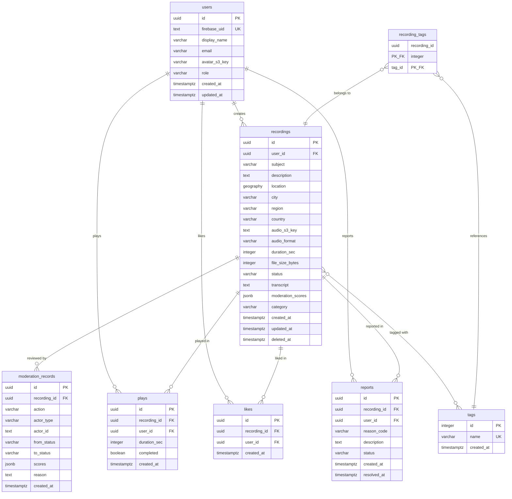

# Hear Here — Database Schema & Data Model

## 1. Technology Choice

**PostgreSQL 16 on Amazon RDS** with the **PostGIS** extension.

### Rationale

| Requirement | Why PostgreSQL + PostGIS |
|---|---|
| Geospatial queries | PostGIS provides native `GEOGRAPHY` types, GiST spatial indexes, and functions like `ST_DWithin` for efficient proximity searches. |
| Relational integrity | Foreign keys, constraints, and transactions ensure data consistency across users, recordings, and moderation records. |
| JSON flexibility | `JSONB` columns allow semi-structured data (moderation scores, metadata) without sacrificing query performance. |
| Maturity | PostgreSQL is battle-tested, well-documented, and has excellent tooling. |
| AWS integration | RDS manages backups, patching, failover, and read replicas. Aurora PostgreSQL is the natural scale-up path. |
| Cost | RDS `db.t4g.medium` is sufficient for early stages (~$50/month). No per-query pricing. |

### Why not DynamoDB?

DynamoDB lacks native geospatial indexing. Implementing proximity queries with geohash partition keys adds significant application-level complexity. The relational nature of our data (users own recordings, recordings have moderation records, users interact with recordings) maps naturally to a relational model. DynamoDB would require denormalization patterns that complicate moderation workflows and audit trails.

---

## 2. Entity Relationship Diagram



---

## 3. Schema Definitions (DDL)

### 3.1 Extensions

```sql
CREATE EXTENSION IF NOT EXISTS "pgcrypto";   -- gen_random_uuid()
CREATE EXTENSION IF NOT EXISTS "postgis";     -- geospatial types and functions
```

### 3.2 Enum Types

We use `VARCHAR` with `CHECK` constraints rather than PostgreSQL `ENUM` types. This avoids the DDL-level `ALTER TYPE` needed to add new enum values, which can be painful in migrations.

### 3.3 Users

```sql
CREATE TABLE users (
    id              UUID PRIMARY KEY DEFAULT gen_random_uuid(),
    firebase_uid    TEXT NOT NULL,
    display_name    VARCHAR(100) NOT NULL,
    email           VARCHAR(255),
    avatar_s3_key   TEXT,
    role            VARCHAR(20) NOT NULL DEFAULT 'user',
    created_at      TIMESTAMPTZ NOT NULL DEFAULT now(),
    updated_at      TIMESTAMPTZ NOT NULL DEFAULT now(),

    CONSTRAINT uq_users_firebase_uid UNIQUE (firebase_uid),
    CONSTRAINT chk_users_role CHECK (role IN ('user', 'moderator', 'admin'))
);

COMMENT ON TABLE users IS 'Application users, linked to Firebase Auth by firebase_uid.';
COMMENT ON COLUMN users.firebase_uid IS 'Firebase Authentication UID. Immutable after creation.';
COMMENT ON COLUMN users.role IS 'Authorization role: user (default), moderator (can review content), admin (full access).';
```

### 3.4 Recordings

```sql
CREATE TABLE recordings (
    id                UUID PRIMARY KEY DEFAULT gen_random_uuid(),
    user_id           UUID NOT NULL REFERENCES users(id) ON DELETE CASCADE,
    subject           VARCHAR(200) NOT NULL,
    description       TEXT,
    location          GEOGRAPHY(Point, 4326) NOT NULL,
    location_name     VARCHAR(300),
    city              VARCHAR(100),
    region            VARCHAR(100),
    country           VARCHAR(100),
    audio_s3_key      TEXT NOT NULL,
    audio_format      VARCHAR(10) NOT NULL DEFAULT 'aac',
    duration_sec      INTEGER NOT NULL,
    file_size_bytes   INTEGER,
    status            VARCHAR(30) NOT NULL DEFAULT 'pending_moderation',
    transcript        TEXT,
    moderation_scores JSONB,
    category          VARCHAR(50),
    play_count        INTEGER NOT NULL DEFAULT 0,
    like_count        INTEGER NOT NULL DEFAULT 0,
    created_at        TIMESTAMPTZ NOT NULL DEFAULT now(),
    updated_at        TIMESTAMPTZ NOT NULL DEFAULT now(),
    deleted_at        TIMESTAMPTZ,

    CONSTRAINT chk_recordings_status CHECK (
        status IN ('pending_upload', 'pending_moderation', 'pending_review', 'approved', 'rejected')
    ),
    CONSTRAINT chk_recordings_duration CHECK (duration_sec > 0 AND duration_sec <= 300),
    CONSTRAINT chk_recordings_audio_format CHECK (audio_format IN ('aac', 'm4a', 'mp3')),
    CONSTRAINT chk_recordings_category CHECK (
        category IS NULL OR category IN (
            'history', 'nature', 'architecture', 'culture', 'personal',
            'food', 'music', 'art', 'politics', 'science', 'other'
        )
    )
);

COMMENT ON TABLE recordings IS 'Audio recordings pinned to real-world locations.';
COMMENT ON COLUMN recordings.location IS 'PostGIS geography point (SRID 4326). Stores lat/lng of the recording.';
COMMENT ON COLUMN recordings.status IS 'Moderation lifecycle: pending_upload -> pending_moderation -> approved/rejected, or pending_moderation -> pending_review -> approved/rejected.';
COMMENT ON COLUMN recordings.moderation_scores IS 'JSON object with per-category moderation scores from the content classifier.';
COMMENT ON COLUMN recordings.deleted_at IS 'Soft delete timestamp. Non-null means the recording is logically deleted.';
COMMENT ON COLUMN recordings.play_count IS 'Denormalized play count, updated asynchronously.';
COMMENT ON COLUMN recordings.like_count IS 'Denormalized like count, updated asynchronously.';
```

### 3.5 Tags

```sql
CREATE TABLE tags (
    id          SERIAL PRIMARY KEY,
    name        VARCHAR(50) NOT NULL,
    created_at  TIMESTAMPTZ NOT NULL DEFAULT now(),

    CONSTRAINT uq_tags_name UNIQUE (name),
    CONSTRAINT chk_tags_name_lowercase CHECK (name = lower(name))
);

CREATE TABLE recording_tags (
    recording_id UUID NOT NULL REFERENCES recordings(id) ON DELETE CASCADE,
    tag_id       INTEGER NOT NULL REFERENCES tags(id) ON DELETE CASCADE,

    PRIMARY KEY (recording_id, tag_id)
);

COMMENT ON TABLE tags IS 'Normalized tag values. Names are always lowercase.';
COMMENT ON TABLE recording_tags IS 'Many-to-many relationship between recordings and tags.';
```

### 3.6 Moderation Records (Audit Trail)

```sql
CREATE TABLE moderation_records (
    id              UUID PRIMARY KEY DEFAULT gen_random_uuid(),
    recording_id    UUID NOT NULL REFERENCES recordings(id) ON DELETE CASCADE,
    action          VARCHAR(30) NOT NULL,
    actor_type      VARCHAR(20) NOT NULL,
    actor_id        TEXT,
    from_status     VARCHAR(30) NOT NULL,
    to_status       VARCHAR(30) NOT NULL,
    scores          JSONB,
    reason          TEXT,
    created_at      TIMESTAMPTZ NOT NULL DEFAULT now(),

    CONSTRAINT chk_moderation_action CHECK (
        action IN ('auto_approve', 'auto_reject', 'escalate_to_review', 'manual_approve', 'manual_reject')
    ),
    CONSTRAINT chk_moderation_actor_type CHECK (
        actor_type IN ('system', 'moderator', 'admin')
    )
);

COMMENT ON TABLE moderation_records IS 'Immutable audit trail of every moderation decision on a recording.';
COMMENT ON COLUMN moderation_records.action IS 'What happened: auto_approve/auto_reject (system), escalate_to_review (system), manual_approve/manual_reject (human).';
COMMENT ON COLUMN moderation_records.actor_type IS 'Who performed the action: system (automated pipeline) or moderator/admin (human).';
COMMENT ON COLUMN moderation_records.actor_id IS 'For human actions, the user ID of the moderator/admin. NULL for system actions.';
COMMENT ON COLUMN moderation_records.scores IS 'Content classification scores at the time of this decision, if applicable.';
COMMENT ON COLUMN moderation_records.reason IS 'Optional human-written reason, especially for rejections.';
```

### 3.7 Plays

```sql
CREATE TABLE plays (
    id              UUID PRIMARY KEY DEFAULT gen_random_uuid(),
    recording_id    UUID NOT NULL REFERENCES recordings(id) ON DELETE CASCADE,
    user_id         UUID NOT NULL REFERENCES users(id) ON DELETE CASCADE,
    duration_sec    INTEGER NOT NULL DEFAULT 0,
    completed       BOOLEAN NOT NULL DEFAULT false,
    created_at      TIMESTAMPTZ NOT NULL DEFAULT now()
);

COMMENT ON TABLE plays IS 'Play events. One row per playback session.';
COMMENT ON COLUMN plays.duration_sec IS 'How many seconds the user actually listened.';
COMMENT ON COLUMN plays.completed IS 'Whether the user listened to the end.';
```

### 3.8 Likes

```sql
CREATE TABLE likes (
    id              UUID PRIMARY KEY DEFAULT gen_random_uuid(),
    recording_id    UUID NOT NULL REFERENCES recordings(id) ON DELETE CASCADE,
    user_id         UUID NOT NULL REFERENCES users(id) ON DELETE CASCADE,
    created_at      TIMESTAMPTZ NOT NULL DEFAULT now(),

    CONSTRAINT uq_likes_user_recording UNIQUE (user_id, recording_id)
);

COMMENT ON TABLE likes IS 'One like per user per recording.';
```

### 3.9 Reports

```sql
CREATE TABLE reports (
    id              UUID PRIMARY KEY DEFAULT gen_random_uuid(),
    recording_id    UUID NOT NULL REFERENCES recordings(id) ON DELETE CASCADE,
    user_id         UUID NOT NULL REFERENCES users(id) ON DELETE CASCADE,
    reason_code     VARCHAR(30) NOT NULL,
    description     TEXT,
    status          VARCHAR(20) NOT NULL DEFAULT 'open',
    resolved_by     UUID REFERENCES users(id),
    created_at      TIMESTAMPTZ NOT NULL DEFAULT now(),
    resolved_at     TIMESTAMPTZ,

    CONSTRAINT chk_reports_reason_code CHECK (
        reason_code IN ('inappropriate', 'spam', 'harassment', 'copyright', 'misinformation', 'other')
    ),
    CONSTRAINT chk_reports_status CHECK (
        status IN ('open', 'reviewing', 'resolved_removed', 'resolved_dismissed')
    )
);

COMMENT ON TABLE reports IS 'User-submitted reports against recordings.';
COMMENT ON COLUMN reports.reason_code IS 'Predefined reason category for the report.';
COMMENT ON COLUMN reports.resolved_by IS 'The moderator/admin user ID who resolved the report.';
```

---

## 4. Index Strategy

### 4.1 Primary Indexes

Every table has a `PRIMARY KEY` which creates a B-tree index automatically.

### 4.2 Geospatial Index

```sql
-- GiST index on recording location for spatial queries (ST_DWithin, ST_Distance)
CREATE INDEX idx_recordings_location
    ON recordings USING GIST (location);
```

This is the most critical index in the system. It enables the proximity-based discovery query to scan only recordings within a bounding box before computing exact distances.

### 4.3 Composite & Filtered Indexes

```sql
-- Discovery query: approved recordings only, with spatial index.
-- The GiST index above handles spatial filtering; this partial index
-- accelerates the status filter within the spatial result set.
CREATE INDEX idx_recordings_status_approved
    ON recordings (status)
    WHERE status = 'approved' AND deleted_at IS NULL;

-- User's own recordings (for "my recordings" screen)
CREATE INDEX idx_recordings_user_id
    ON recordings (user_id, created_at DESC)
    WHERE deleted_at IS NULL;

-- Moderation queue: pending recordings for human review
CREATE INDEX idx_recordings_pending_review
    ON recordings (created_at ASC)
    WHERE status = 'pending_review' AND deleted_at IS NULL;

-- Moderation audit trail per recording
CREATE INDEX idx_moderation_records_recording_id
    ON moderation_records (recording_id, created_at ASC);

-- Play history per user
CREATE INDEX idx_plays_user_id
    ON plays (user_id, created_at DESC);

-- Play counts per recording (for denormalized counter refresh)
CREATE INDEX idx_plays_recording_id
    ON plays (recording_id);

-- Likes per user (for checking "did I like this?")
-- The UNIQUE constraint on (user_id, recording_id) already serves as an index.

-- Open reports for moderation queue
CREATE INDEX idx_reports_status_open
    ON reports (created_at ASC)
    WHERE status IN ('open', 'reviewing');

-- Firebase UID lookup (covered by UNIQUE constraint on users.firebase_uid)

-- Tag lookup by name (covered by UNIQUE constraint on tags.name)

-- Recording tags lookup
CREATE INDEX idx_recording_tags_tag_id
    ON recording_tags (tag_id);
```

### 4.4 Index Rationale Summary

| Query Pattern | Index Used | Type |
|---|---|---|
| Nearby approved recordings | `idx_recordings_location` + `idx_recordings_status_approved` | GiST + partial B-tree |
| My recordings | `idx_recordings_user_id` | Composite B-tree |
| Moderation review queue | `idx_recordings_pending_review` | Partial B-tree |
| Moderation history for a recording | `idx_moderation_records_recording_id` | Composite B-tree |
| User's play history | `idx_plays_user_id` | Composite B-tree |
| Has user liked recording? | `uq_likes_user_recording` (unique constraint) | B-tree |
| Open reports queue | `idx_reports_status_open` | Partial B-tree |
| User lookup by Firebase UID | `uq_users_firebase_uid` (unique constraint) | B-tree |

---

## 5. Key Query Patterns

### 5.1 Discover Nearby Recordings

```sql
SELECT
    r.id,
    r.subject,
    r.description,
    r.category,
    r.duration_sec,
    r.like_count,
    r.play_count,
    r.created_at,
    u.display_name AS creator_name,
    ST_Y(r.location::geometry) AS latitude,
    ST_X(r.location::geometry) AS longitude,
    ST_Distance(r.location, ST_MakePoint(:lng, :lat)::geography) AS distance_m
FROM recordings r
JOIN users u ON u.id = r.user_id
WHERE r.status = 'approved'
  AND r.deleted_at IS NULL
  AND ST_DWithin(r.location, ST_MakePoint(:lng, :lat)::geography, :radius_m)
ORDER BY distance_m ASC
LIMIT 50;
```

**Performance notes:**
- `ST_DWithin` with `GEOGRAPHY` type uses the GiST index to filter candidates by bounding box, then computes exact geodesic distance.
- Default radius: 500m. Maximum: 5,000m. Larger radii increase candidate set but PostGIS handles this efficiently.
- The `LIMIT 50` caps result size. Pagination is by increasing radius or cursor-based (by distance).

### 5.2 Get User's Recordings

```sql
SELECT id, subject, status, duration_sec, category, play_count, like_count, created_at
FROM recordings
WHERE user_id = :user_id
  AND deleted_at IS NULL
ORDER BY created_at DESC
LIMIT 20 OFFSET :offset;
```

### 5.3 Moderation Review Queue

```sql
SELECT
    r.id,
    r.subject,
    r.description,
    r.audio_s3_key,
    r.transcript,
    r.moderation_scores,
    r.duration_sec,
    r.created_at,
    u.display_name AS creator_name
FROM recordings r
JOIN users u ON u.id = r.user_id
WHERE r.status = 'pending_review'
  AND r.deleted_at IS NULL
ORDER BY r.created_at ASC
LIMIT 20;
```

### 5.4 Moderation Audit Trail

```sql
SELECT
    mr.action,
    mr.actor_type,
    mr.actor_id,
    mr.from_status,
    mr.to_status,
    mr.scores,
    mr.reason,
    mr.created_at,
    u.display_name AS actor_name
FROM moderation_records mr
LEFT JOIN users u ON u.firebase_uid = mr.actor_id
WHERE mr.recording_id = :recording_id
ORDER BY mr.created_at ASC;
```

### 5.5 Check If User Liked a Recording

```sql
SELECT EXISTS (
    SELECT 1 FROM likes
    WHERE user_id = :user_id AND recording_id = :recording_id
) AS liked;
```

### 5.6 Update Denormalized Counters

```sql
-- Refresh play_count (run periodically or on each play event)
UPDATE recordings
SET play_count = (SELECT COUNT(*) FROM plays WHERE recording_id = :recording_id),
    updated_at = now()
WHERE id = :recording_id;

-- Refresh like_count (run on like/unlike)
UPDATE recordings
SET like_count = (SELECT COUNT(*) FROM likes WHERE recording_id = :recording_id),
    updated_at = now()
WHERE id = :recording_id;
```

---

## 6. Moderation Workflow

### 6.1 State Machine

```
                                      +-----------+
                                      |  pending   |
                                      |  _upload   |
                                      +-----+-----+
                                            |
                                    S3 upload completes
                                            |
                                            v
                                    +-------+--------+
                                    |   pending      |
                                    |  _moderation   |
                                    +---+--------+---+
                                        |        |
                            auto-approve |        | uncertain
                            (high conf)  |        | (low conf)
                                        v        v
                                  +--------+  +--------+
                  auto-reject <-- | result | +>| pending|
                  (high conf)     | eval   |   | _review|
                       +          +--------+   +---+----+
                       |                           |
                       v                    human decision
                  +---------+              /           \
                  | rejected|             v             v
                  +---------+       +---------+   +---------+
                       ^            | approved|   | rejected|
                       |            +---------+   +---------+
                       |                 ^
                       +-----------------+
                       (report resolved: remove)
```

### 6.2 Status Transitions

| From | To | Trigger | Actor |
|---|---|---|---|
| `pending_upload` | `pending_moderation` | S3 upload event notification | System |
| `pending_moderation` | `approved` | Auto-classification PASS (confidence >= 0.95) | System |
| `pending_moderation` | `rejected` | Auto-classification FAIL (confidence >= 0.95) | System |
| `pending_moderation` | `pending_review` | Auto-classification UNCERTAIN | System |
| `pending_review` | `approved` | Human moderator approves | Moderator |
| `pending_review` | `rejected` | Human moderator rejects | Moderator |
| `approved` | `rejected` | Report resolved with removal | Admin |

### 6.3 Audit Trail

Every status transition creates an immutable row in `moderation_records`. This provides a complete audit trail:

```sql
-- Example: system auto-approves
INSERT INTO moderation_records (recording_id, action, actor_type, from_status, to_status, scores)
VALUES (:recording_id, 'auto_approve', 'system', 'pending_moderation', 'approved', :scores_json);

-- Example: moderator rejects
INSERT INTO moderation_records (recording_id, action, actor_type, actor_id, from_status, to_status, reason)
VALUES (:recording_id, 'manual_reject', 'moderator', :moderator_firebase_uid, 'pending_review', 'rejected', 'Contains copyrighted music');
```

---

## 7. Soft Deletes and Data Retention

### Strategy

Recordings use **soft deletes** via the `deleted_at` timestamp column:

- When a user deletes their own recording, `deleted_at` is set to `now()`.
- When a recording is rejected, it remains in the database (for potential appeals) but is not discoverable.
- All queries that return recordings to end users filter with `WHERE deleted_at IS NULL`.
- A scheduled cleanup job permanently deletes soft-deleted recordings (and their S3 audio files) after **30 days**.

### User Account Deletion

When a user requests account deletion (GDPR / App Store requirement):

1. All their recordings are soft-deleted.
2. User row is anonymized: `display_name` set to `'Deleted User'`, `email` set to `NULL`, `firebase_uid` set to `'deleted_<uuid>'`.
3. Likes and plays by the user are deleted.
4. Reports by the user are anonymized (user_id set to the anonymized user).
5. The Firebase Auth account is deleted via Admin SDK.

---

## 8. Denormalization Strategy

Two counters are denormalized onto the `recordings` table for read performance:

| Column | Source | Update Trigger |
|---|---|---|
| `play_count` | `COUNT(*) FROM plays WHERE recording_id = ?` | Incremented on each play event via Lambda |
| `like_count` | `COUNT(*) FROM likes WHERE recording_id = ?` | Incremented/decremented on like/unlike via Lambda |

These avoid expensive `COUNT` joins in the discovery query, which is the highest-traffic query in the system. The counters are eventually consistent — a small lag is acceptable for display purposes.

If counters drift, a periodic reconciliation job can reset them:

```sql
UPDATE recordings r
SET play_count = (SELECT COUNT(*) FROM plays p WHERE p.recording_id = r.id),
    like_count = (SELECT COUNT(*) FROM likes l WHERE l.recording_id = r.id),
    updated_at = now()
WHERE r.deleted_at IS NULL;
```

---

## 9. `updated_at` Trigger

All tables with `updated_at` use a trigger to keep the timestamp current:

```sql
CREATE OR REPLACE FUNCTION update_updated_at_column()
RETURNS TRIGGER AS $$
BEGIN
    NEW.updated_at = now();
    RETURN NEW;
END;
$$ LANGUAGE plpgsql;

CREATE TRIGGER trg_users_updated_at
    BEFORE UPDATE ON users
    FOR EACH ROW EXECUTE FUNCTION update_updated_at_column();

CREATE TRIGGER trg_recordings_updated_at
    BEFORE UPDATE ON recordings
    FOR EACH ROW EXECUTE FUNCTION update_updated_at_column();
```

---

## 10. Migration Strategy

### Tool: node-pg-migrate

**Rationale:** Lightweight, SQL-based migration runner for Node.js. Fits the Lambda + Node.js backend stack. Alternatives like Flyway or Prisma are viable but add more weight.

### Migration Files

```
scripts/migrations/
├── 001_create_extensions.sql
├── 002_create_users.sql
├── 003_create_recordings.sql
├── 004_create_tags.sql
├── 005_create_moderation_records.sql
├── 006_create_plays.sql
├── 007_create_likes.sql
├── 008_create_reports.sql
├── 009_create_indexes.sql
└── 010_create_triggers.sql
```

### Migration Execution

- **Local development:** Run migrations against a local PostgreSQL (Docker) instance via `npm run migrate:up`.
- **Staging / Production:** Run migrations as a one-off Lambda invocation or ECS task before deploying new application code. The CDK deployment pipeline triggers migration as a pre-deployment step.
- **Rollback:** Each migration file includes both `up` and `down` functions. Rollback via `npm run migrate:down`.

### Principles

1. **Forward-only in production.** Rollbacks are for emergencies; prefer writing new migrations to undo changes.
2. **No breaking changes without a multi-step migration.** For example, renaming a column requires: (a) add new column, (b) backfill, (c) switch application code, (d) drop old column.
3. **All migrations are idempotent** where possible (use `IF NOT EXISTS`).
4. **Migrations run inside a transaction** (PostgreSQL DDL is transactional).

---

## 11. Scalability Considerations

### Phase 1: 0 - 10,000 Users

- **Instance:** Single RDS `db.t4g.medium` (2 vCPU, 4 GB RAM).
- **Storage:** 20 GB gp3 SSD, auto-scaling enabled.
- **Connections:** Direct Lambda-to-RDS connections via **RDS Proxy** to manage connection pooling (Lambda can exhaust connections otherwise).
- **Estimated recordings:** ~50,000 at this stage. All queries perform well on a single node.

### Phase 2: 10,000 - 100,000 Users

- **Read replicas:** Add 1-2 read replicas for discovery queries (read-heavy workload). Write operations (recording creation, moderation updates) go to the primary.
- **Instance upgrade:** `db.r7g.large` (2 vCPU, 16 GB RAM) for better caching of spatial index pages.
- **Estimated recordings:** ~500,000. PostGIS GiST index remains efficient. Consider `CLUSTER` on the spatial index periodically to improve locality.
- **Partitioning evaluation:** Monitor if table scans become slow. If recordings are geographically clustered, range partitioning by region (continent or country) could help, but is unlikely to be necessary at this scale.

### Phase 3: 100,000+ Users

- **Aurora PostgreSQL:** Migrate from RDS to Aurora for auto-scaling storage (up to 128 TB), up to 15 read replicas, and faster failover.
- **Table partitioning:** Partition `plays` table by month (it will be the highest-volume table). Partition `recordings` by status or region if needed.
- **Connection pooling:** Continue using RDS Proxy. Consider PgBouncer if more control is needed.
- **Caching:** Add an ElastiCache (Redis) layer for:
  - Hot recording metadata (frequently played recordings)
  - Discovery query result caching (cache nearby results for a location + radius for 60 seconds)
  - User session data

### Plays Table Partitioning (Phase 3)

```sql
-- Partition by month for efficient querying and archival
CREATE TABLE plays (
    id              UUID NOT NULL DEFAULT gen_random_uuid(),
    recording_id    UUID NOT NULL,
    user_id         UUID NOT NULL,
    duration_sec    INTEGER NOT NULL DEFAULT 0,
    completed       BOOLEAN NOT NULL DEFAULT false,
    created_at      TIMESTAMPTZ NOT NULL DEFAULT now()
) PARTITION BY RANGE (created_at);

-- Create monthly partitions
CREATE TABLE plays_2026_01 PARTITION OF plays
    FOR VALUES FROM ('2026-01-01') TO ('2026-02-01');
CREATE TABLE plays_2026_02 PARTITION OF plays
    FOR VALUES FROM ('2026-02-01') TO ('2026-03-01');
-- ... automated via pg_partman or a scheduled Lambda
```

### Connection Pooling

Lambda functions open a new database connection on each cold start. Without pooling, this can exhaust PostgreSQL's `max_connections`. **RDS Proxy** sits between Lambda and RDS:

- Maintains a persistent connection pool to RDS.
- Lambda connects to RDS Proxy (same interface, just a different endpoint).
- RDS Proxy multiplexes hundreds of Lambda connections into a small pool of database connections.
- Configured in the CDK `database-stack.ts`.

---

## 12. Backup and Recovery

| Mechanism | Configuration |
|---|---|
| Automated backups | RDS automated backups, 7-day retention |
| Point-in-time recovery | Enabled (continuous WAL archiving to S3) |
| Manual snapshots | Before major migrations |
| Multi-AZ | Enabled in production for automatic failover |
| Cross-region | Not initially; add Aurora Global Database if needed in Phase 3 |

---

## 13. Security

| Concern | Mitigation |
|---|---|
| Credentials | Stored in AWS Secrets Manager, rotated automatically. Lambda retrieves at cold start. |
| Encryption at rest | RDS encryption enabled (AES-256, AWS-managed key). |
| Encryption in transit | TLS enforced (`sslmode=require` in connection string). |
| Network isolation | RDS in private subnets, no public IP. Lambda in same VPC accesses via private endpoint. |
| Least privilege | Lambda execution role has minimal RDS permissions. No `DROP` or `CREATE` in application roles. |
| Application DB role | Separate `app_user` role with `SELECT, INSERT, UPDATE, DELETE` on application tables only. No DDL. |
| Migration DB role | Separate `migration_user` role with DDL permissions, used only during deployments. |

### Database Roles

```sql
-- Application role (used by Lambda functions)
CREATE ROLE app_user WITH LOGIN PASSWORD '...' ;
GRANT CONNECT ON DATABASE hearhere TO app_user;
GRANT USAGE ON SCHEMA public TO app_user;
GRANT SELECT, INSERT, UPDATE, DELETE ON ALL TABLES IN SCHEMA public TO app_user;
GRANT USAGE ON ALL SEQUENCES IN SCHEMA public TO app_user;
ALTER DEFAULT PRIVILEGES IN SCHEMA public GRANT SELECT, INSERT, UPDATE, DELETE ON TABLES TO app_user;

-- Migration role (used during deployments only)
CREATE ROLE migration_user WITH LOGIN PASSWORD '...' ;
GRANT ALL PRIVILEGES ON DATABASE hearhere TO migration_user;
```

---

## 14. Complete DDL Summary

For quick reference, here is the full creation order:

1. Extensions (`pgcrypto`, `postgis`)
2. `users`
3. `recordings`
4. `tags`
5. `recording_tags`
6. `moderation_records`
7. `plays`
8. `likes`
9. `reports`
10. Indexes (all listed in Section 4)
11. Triggers (`updated_at`)
12. Database roles
